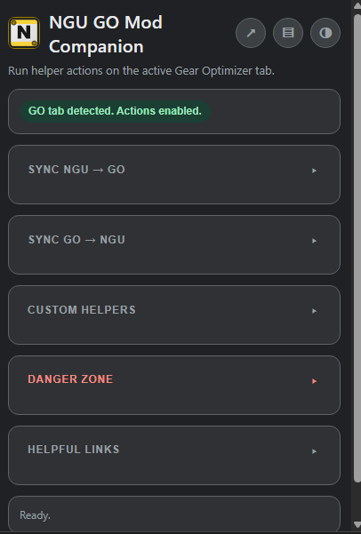

# NGU GO Mod Companion

Small MV3 extension that turns NGU Idle and Gear Optimizer helper bookmarklets from jshepler's mod into popup actions.



## Features

Buttons run on the active Gear Optimizer tab and support:

- **Flexible UI View Modes**
  - Standard extension popup.
  - Dedicated popout app window (instantiated via the header controls).
  - Persistent Side Panel companion layout for seamless multitasking on supported windows.
  - Compact icon buttons in the header for quick, non-intrusive view toggling.

- **Intelligent Window & Tab Targeting**
  - Cross-window tab tracking allows detached views (popout/side panel) to find your active GO page context.
  - PWA/Standalone app mode safety guards automatically disable unsupported side panel components to prevent layout conflicts.
  - Dynamic status routing: if GO isn't selected, quickly switch to an already open GO tab or launch a fresh target tab directly from the extension status card.

- **GO to NGU Integration**
  - Loadouts to NGU.
  - Hack targets to NGU.

- **NGU to GO Integration**
  - Current equipped to GO slot current.
  - Naked EMR3 to GO hardcap input.
  - Aug stats.
  - NGU stats.
  - Hack stats (keep targets).
  - Hack stats + reset targets (danger zone).
  - Wish stats.

- **Custom Helpers**
  - Set all hack targets to hard caps.

- **Customization**
  - Integrated theme toggle supporting dedicated light and dark color schemes with persistent preference memory.

## Safety behavior

The risky action Hack Stats + Reset Targets is isolated in a Danger Zone and requires a deliberate arming step.

1. Click `Arm 5s Confirmation`.
2. Click `Hack Stats + Reset Targets` while armed.

This helps avoid accidental target wipes from misclicks.

## Requirements

- Chrome or Chromium (Edge and Firefox might get support in the future)
- NGU Idle mod remote triggers active on http://localhost:8088
- Gear Optimizer open in browser at https://gmiclotte.github.io/gear-optimizer

## Credits

- Gear Optimizer by gmiclotte: https://gmiclotte.github.io/gear-optimizer
- NGU GO integration bookmarklet ideas from jshepler's NGU mods repo: https://github.com/jshepler/jshepler.ngu.mods
- NGU Idle game by 4G and all core game systems this helper builds around: https://store.steampowered.com/app/1147690/NGU_IDLE/
- NGU Idle Fandom Wiki: https://ngu-idle.fandom.com/wiki/NGU_Idle_Wiki
- Sayo's NGU guide: https://sayolove.github.io/ngu-guide/

## Disclaimer

- This is an unofficial fan-made helper for personal use.
- All game and tool trademarks and original content belong to their respective creators.
- I am primarily a Python developer, therefore AI was used extensively to build the extension. While I aim to understand the code AI creates there is still a lot I don't, but it just works for the most part 🤷.

## Load extension locally

1. Open chrome://extensions.
2. Enable Developer mode.
3. Click Load unpacked.
4. Select this repository root folder.

## Development

This repository uses Prettier and ESLint for quality checks.

1. Install Node.js 22 or newer.
2. Install dependencies:

```bash
npm install
```

3. Run quality checks:

```bash
npm run format:check
npm run lint
```

4. Apply formatting and lint fixes locally:

```bash
npm run format
npm run lint:fix
```

## CI

GitHub Actions runs formatting and lint checks on pushes and pull requests.

Workflow: .github/workflows/ci.yml

## Versioning and releases

- Versions follow Semantic Versioning.
- Notable changes are tracked in CHANGELOG.md.

## Security

See SECURITY.md for vulnerability reporting guidance.
